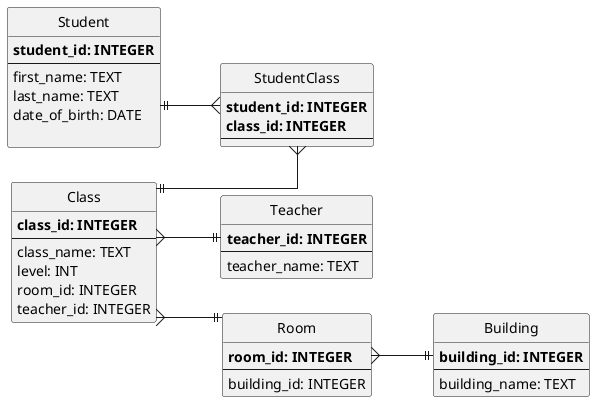

  1 # ER Diagram

This is my diagram for my competitor app to KAMAR

## Instructions for build steps
In your intro repository 
 - Make sure you have the Sqlite extension installed in VSCode. 
 - Download the files from Google Classroom and add them to your repository folder.
   - createdb.sql
   - loadtestdata.sql
   - databasediagram.md (this file)
 - Create a file newdb.db in VSCode
 - Press `Control-Shift-P` and type SQLite: Open Database - choose newdb.db
 - Open createdb.sql and press `Control-Shift-P` and choose `SQLite: Run Query`. You should pick _newdb.db_ to run the query against.
    - If you get an error referencing FOREIGN KEY contraint - comment out the line `PRAGMA FOREIGN KEYS on`
 - Open loadtestdata.sql and press `Control-Shift-P` and choose `SQLite: Run Query`. You should pick _newdb.db_ to run the query against.

You should review the code in loadtestdata.sql to help you with your next steps.

You should review how to filter rows with a WHERE clause. https://www.w3schools.com/sql/sql_where.asp

You should review how to JOIN two tables. https://www.w3schools.com/sql/sql_join.asp

## Some tasks

### SELECTing Data
1. `SELECT` all students ordered by date of birth. https://www.w3schools.com/sql/sql_orderby.asp
1. `SELECT` all students whose first name is 'Gene' 
1. `SELECT` all students whose last_name ends with 'Y' https://www.w3schools.com/sql/sql_like.asp

1. `SELECT` all classes that are not in room 44. https://www.w3schools.com/sql/sql_not.asp
1. `SELECT` all classes in room 44 or room 43. https://www.w3schools.com/sql/sql_or.asp
1. `SELECT` all classes in rooms > 43. https://www.w3schools.com/sql/sql_or.asp
1. `SELECT` all teachers who teach in room 44 or room 43. https://www.w3schools.com/sql/sql_or.asp
1. `SELECT` all students who have lessons in room 44. https://www.w3schools.com/sql/sql_join_inner.asp

1. `SELECT` all students who have Mr Duncan as a teacher. https://www.w3schools.com/sql/sql_join_inner.asp

### ALTERing Data
1. `UPDATE` the building name for building_id = 2 so that it is spelled correctly. https://www.w3schools.com/sql/sql_update.asp

1. `INSERT` another student into the `Student` table. https://www.w3schools.com/sql/sql_insert.asp
1. `INSERT` a new English teacher into the `Teacher` table.
1. `INSERT` another room into the rooms table. The room must be in Hiwi.
1. `INSERT` another class (English) and assign it to the new teacher and room.
1. `INSERT` a row into StudentClass table to assign the new class to the student you have just created.
1. `UPDATE` one of the students so that they have changed their Drama class to English.
1. `DELETE` the student who is the oldest. Do you get an error? Why does this happen? 
1. `DELETE` the `StudentClass` data for the student who is the oldest, then delete the student. You might need to use the `IN` clause to delete the correct rows. https://www.w3schools.com/sql/sql_in.asp

### Aggregating Data 
https://www.w3schools.com/sql/sql_aggregate_functions.asp
1. `SELECT` the count of all the different classes.https://www.w3schools.com/sql/sql_count.asp
1. `SELECT` the count of the different classes by student.https://www.w3schools.com/sql/sql_count.asp
1. `SELECT` each teacher along with a count of how many classes they teach. (you'll need to join tables.)
1. `SELECT` classes with  more than 2 students. https://www.w3schools.com/sql/sql_having.asp

